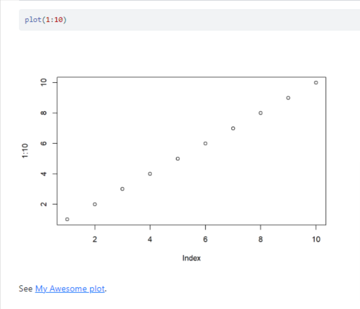
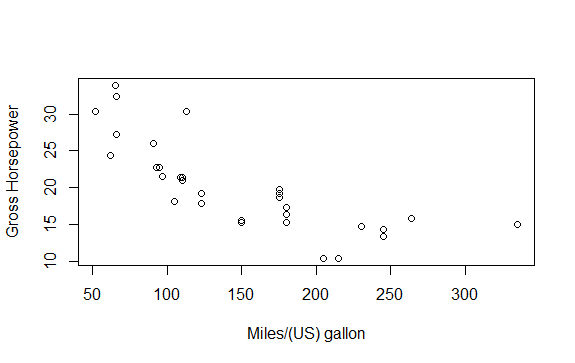
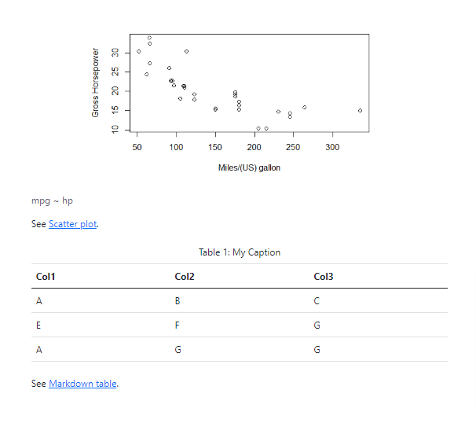

# Nameref Extension For Quarto

A Quarto filter extension that allows to refer to section (like what latex package [`\nameref`](https://mirror.las.iastate.edu/tex-archive/macros/latex/contrib/hyperref/doc/nameref.pdf) does), figure, image using a text/name instead of section number or plain `Figure #` or `Table #`. This filter works for both format `html` and `pdf`.

## Installing

```bash
quarto add shafayetShafee/nameref
```

This will install the extension under the `_extensions` subdirectory.
If you're using version control, you will want to check in this directory.

## Using

### Refer to a section using the text of the section header

To refer to a section, add an identifier, suppose `#how`, to header and use `\nameref{how}` to reference that section.

```
## Why Quarto is so great {#how}

See \nameref{how}.
```

And in rendered document this looks like,


### Refer to code chunk generated plot or table

To name refer a plot or table generated from table, use the chunk option `link-id` that works as identifier and `link-title` that works as the reference text.

````
```{r}
#| link-id: fig1
#| link-title: My Awesome plot

plot(1:10)
```

See \nameref{fig1}.

````

which looks like,




Note that, `nameref` does not interfere with [Quarto's way](https://quarto.org/docs/authoring/cross-references.html#overview) of cross-referencing. You can use `label` and `fig-cap` to refer to this plot in usual way.


### Refer to image or table written in markdown syntax

To use `nameref` for [markdown images](https://quarto.org/docs/authoring/figures.html#figure-basics) or for [markdown tables](https://quarto.org/docs/authoring/tables.html#markdown-tables), wrap the image or table with [Divs](https://quarto.org/docs/authoring/markdown-basics.html#divs-and-spans) (`:::`) with class `link` and `link-id`, `link-title` attributes.

````
::: {.link link-id="fig2" link-title="Scatter plot"}



:::

See \nameref{fig2}.

````

````
::: {.link link-id="tab2" link-title="Markdown table"}

| Col1 | Col2 | Col3 |
|------|------|------|
| A    | B    | C    |
| E    | F    | G    |
| A    | G    | G    |

: My Caption {#tbl-tab2}

:::

See \nameref{tab2}.

````

And this looks like, 




## Example

Here is the source code for a example: [example.qmd](example.qmd), containing the above all examples together in one place and the [live demo](https://shafayetshafee.github.io/nameref/example.html) of the rendered document in HTML output format. 

